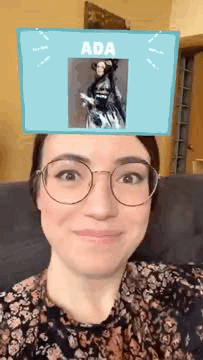

# :sparkles: ARadalabersfilter :sparkles:

## :star: What is it?
This is an Instagram filter made to celebrate the first Adalaber interpromotional meeting. 

An instagram filter is: Augmented reality (AR) filters are computer-generated effects layered over the real-life image your camera displays. In Instagram Stories, an AR filter alters the image your front or back camera displays.

For more info about this, here is an article that might help you --> https://blog.hootsuite.com/instagram-ar-filters/

## :calling: How to use the Filter

## :computer: How to see the project

## :raising_hand: Personal' goals

## :dart: Project' goals

